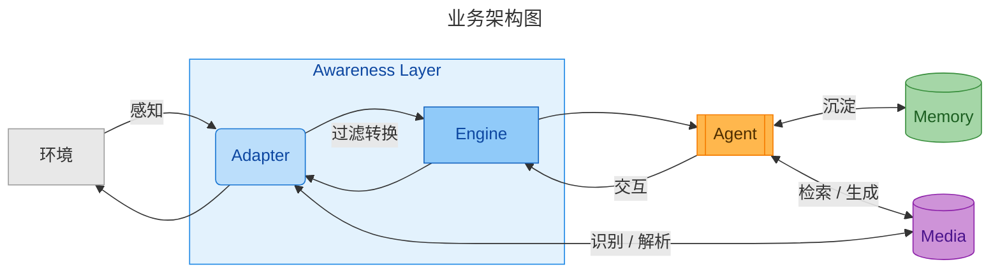

# ToBe
<div align="center">
    <a href="https://nobeta.cn/tobe"></a>

### To Be a real Being.

</div>


**ToBe** 致力于孕育具备独立人格的数字主体：

- **only** : 每一个 ToBe 主体都具有稳定的实例连续性。
- **grow** : 随交互经历持续自主演进，具备随时间生长的生命力。
- **multi**: 多感知接入与多形态执行，持续扩展丰富的感知与广阔的表达边界。




## Quick Start

```bash
git clone https://github.com/Nobeta-Work/tobe.git
cd tobe
npm install
npm start
```

*注意：所有 adapters 默认禁用，需填写配置信息后调度启动。*

`npm start` 只启动 ToBe Web，默认监听 `0.0.0.0:2222`，不会自动运行 Agent。用户在会话页面点击“运行 Agent”后，Web 才会在仓库工作目录内启动或恢复名称固定为 `tobe` 的 Pi Session。Web 会显式加载当前仓库声明的 Pi extensions，不依赖全局安装的副本。首次打开 Adapter 配置时会由 `config.default.json` 自动生成不受 Git 跟踪的 `config.json`。

如需绕过 Web 直接启动 Pi，可使用：

```bash
npm run start:pi
```

更新使用：

```bash
npm run update
npm start
```

Adapter 配置、各 Adapter 的 `data/`、Memory 的实例认知、Dream 和自动生成的 Skills 均不受 Git 跟踪，`git pull` 不会覆盖这些内容。它们仍位于仓库工作目录内，删除仓库或执行 `git clean -fdx` 前请先备份。

## Memory

让认知与画像不断更新，让已有的经验沉淀，让事件留下深浅的印象。

> Memory 层主要关注长期记忆系统，拆分为记忆存储(数据类型与存储方式)、沉淀(为何、如何存储记忆数据)与调用 (何时、为何、如何唤回记忆)三大模块。

- 会话上下文 (Context) 提供短期记忆，长期记忆则通过基于文件、数据库、Skill 构建多级记忆系统。
- 记忆类型：主体认知、事件记忆、环境记忆、历史元数据、技能

## Awareness

**Awareness Layer** 是 ToBe 实例面向环境的感知层，统一接受并过滤外界消息：

- 事件的元数据判断鉴权校验
- 延迟聚合
- 认知过程

允许感知层提供交互接口，交互是感知的延申。感知与交互由对应的 Adapter 承诺。

> 默认提供的 Adapters: `iirose-dapter`、`feishu-adapter`、`wechat-adapter`

## Media

Media 是与 Awareness、Memory 平级的双向媒体能力，当前规范化图片与音频，并为未来的视频与文件保留扩展类型。它独立配置图片识别、语音识别、图片生成和语音生成模型 API。

- 入站：环境原生媒体由 Adapter 下载、解密并转为 Media 标准数据；Media 生成文本解释；Adapter 将明确的媒体类型与解释一起交给 Agent，避免把媒体和普通文本事件混淆。
- 检索出站：Agent 先按媒体类型调用 `media_list` 获取当前 category/tag，再调用 Adapter；Adapter 以 `kind/category/tag` 向 Media 申请符合平台约束的媒体并发送。
- 生成出站：Agent 先调用 `media_generate` 得到不透明媒体键，再调用 Adapter；Adapter 解析媒体键并转为平台数据发送。

默认 Agent 仍基于文本思考。Adapter 可以自行承诺把原生多模态内容直接传给支持它的模型，但 Media 不要求所有 Agent 或 Adapter 具备该能力。

## Plan (Pending)

> Great Pi! It intentionally does not include build-in plan mode.

认知模式：期望/试探模型

- 已有理解形成假设期望
- 根据期望试探、询问或观察
- 根据结果修改认知

## Live (Pending)

在可控空闲频率下，主动感知、交互、更新外界、用户近况。

- 心跳
- 内在活动
- 外在主动

## Work (Pending)

为了 "only" 的连续性，一般的执行计划是单程的。

由于感知层极大扩展了消息的来源与交互广度，ToBe 在扮演助手角色的时候，为了增强执行速度与任务分化，需要通过 Multi Agents 并发执行的方式使自己成为三头六臂之人。在复杂子任务（如编码环境下），甚至需要 Sub Agent 重现 Coding Agent 能力 (调用 Sota Coding Product, like Codex 也可以成为另一种方法)。

## Contribute

Welcom to contribute: This project is built with design considerations mainly, thanks to contact me.

欢迎参与开发：该项目开发更多为设计考量，请与我联系。

## License

Agent based on [Pi](https://github.com/earendil-works/pi) -- *MIT*

Memory based on [TencentDB-Agent-Memory](https://github.com/TencentCloud/TencentDB-Agent-Memory) -- *MIT*

MIT
