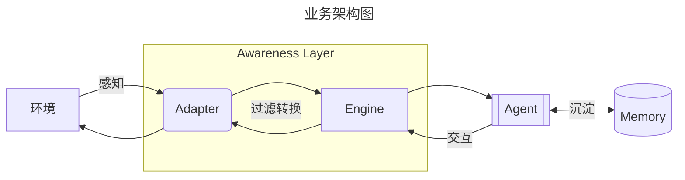

# ToBe
<div align="center">
    <a href="https://nobeta.cn/tobe"></a>
    
### To be a real being

</div>


**ToBe** 期望孕育一个数字主体：

- *only* : 每一个 ToBe 主体都具有稳定的实例连续性。
- *grow* :
- *multi*: 丰富的感知与广阔的执行边界

> 使用 Pi 为 Agent ，各模块以 Pi Extension 加载实现。



## Quick Start

请确保安装 [Pi]([earendil-works/pi: AI agent toolkit: unified LLM API, agent loop, TUI, coding agent CLI](https://github.com/earendil-works/pi)) 。

```bash
curl -fsSL https://pi.dev/install.sh | sh
```

将项目模块以 Extensions 形式加载入 Pi ，按需修改 Adapter 配置。

```bash

pi install git:github.com/Nobeta-Work/tobe

```

*注意：所有 adapters 默认禁用，需填写配置信息后调度启动。*
*当前不保证 `pi update` 能无冲突保留 SELF、USER、Dream 和自动生成的 Skills*

## Memory

感知世界的流动，活在当下；让认知与画像不断更新，让已有的经验沉淀，让事件留下深浅的印象。

> Memory 层主要关注长期记忆系统，拆分为记忆存储(数据类型与存储方式)、沉淀(为何、如何存储记忆数据)与调用 (何时、为何、如何唤回记忆)三大模块。

- 会话上下文 (Context) 提供短期记忆，长期记忆则通过基于文件、数据库、Skill 构建多级记忆系统。
- 记忆类型：主体认知、事件记忆、环境记忆、历史元数据、技能

## Awareness

**Awareness Layer** 是 ToBe 实例面向环境的感知层，统一接受并过滤外界消息：

- 事件的元数据判断鉴权校验
- 延迟聚合
- 认知过程

允许感知层提供交互接口，交互是感知的延申。感知与交互由对应的 Adapter 承诺。

> 默认提供的 Adapters: `iirose-dapter`、`feishu-adapter`、`wechat-adapter`

## Plan (Pending)

> Great Pi! It intentionally does not include build-in plan mode.

认知模式：期望/试探模型

- 已有理解形成假设期望
- 根据期望试探、询问或观察
- 根据结果修改认知

## Live (Pending)

在可控空闲频率下，主动感知、交互、更新外界、用户近况。

- 心跳
- 内在活动
- 外在主动

## Work (Pending)

为了 "only" 的连续性，一般的执行计划是单程的。

由于感知层极大扩展了消息的来源与交互广度，ToBe 在扮演助手角色的时候，为了增强执行速度与任务分化，需要通过 Multi Agents 并发执行的方式使自己成为三头六臂之人。在复杂子任务（如编码环境下），甚至需要 Sub Agent 重现 Coding Agent 能力 (调用 Sota Coding Product, like Codex 也可以成为另一种方法)。

## Contribute

Welcom to contribute: This project is built with design considerations mainly, thanks to contact me.

欢迎参与开发：该项目开发更多为设计考量，请与我联系。

## License

Agent based on [Pi](https://github.com/earendil-works/pi) -- *MIT*

Memory based on [TencentDB-Agent-Memory](https://github.com/TencentCloud/TencentDB-Agent-Memory) -- *MIT*

MIT