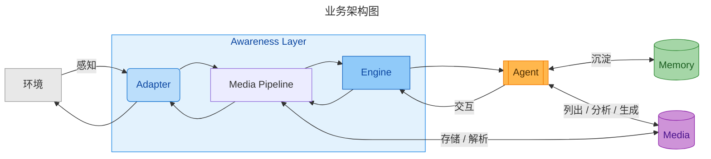

<div align="center">


<br>

# 🦄 To Be (成人)

### *To Be a Real Being*

[](https://www.npmjs.com/package/@nobeta/tobe)
[](./LICENSE)
[](https://nodejs.org/)

Model plus Harness equals Agent. Agent plus Plugins equals Being.

[**简体中文**](./README.md) · [**English**](docs/README_EN.md)

</div>

---

**ToBe** 致力于通过插件让 Agent 在数字空间成为人的存在：

- **only** : 每一个 ToBe 主体都具有稳定的实例连续性。
- **grow** : 随交互经历持续自主演进，具备随时间成长的生命力。
- **multi**: 多感知接入与多形态执行，持续扩展丰富的感知与广阔的表达边界。




| 模块介绍 | 说明 |
| ------ | ---------- |
| [Web](./web/README.md) | 单用户控制台、长期 Pi Session 与配置管理 |
| [Awareness](./awareness/README.md) | 环境 Adapter、消息分级、主动推送与交互路由 |
| [Memory](./memory/README.md) | 持久认知、Dream 与可演化 Skills |
| [Media](./media/README.md) | 图片/音频识别、检索、生成与 Awareness 联动 |

## Quick Start

```bash
# 克隆仓库
git clone https://github.com/Nobeta-Work/tobe.git
cd tobe
# 安装依赖并启动 web
npm install
npm start
```

`npm start` 只启动 ToBe Web，默认监听 `0.0.0.0:2222`，不自动运行 Agent。需在会话页面点击“运行 Agent”后，才会在仓库工作目录内启动或恢复名称固定为 `tobe` 的 Pi Session。

Web 会显式加载当前仓库声明的 Pi extensions，不依赖全局安装的副本。
如需绕过 Web 直接启动 Pi，请使用：

```bash
npm run start:pi
```

更新使用：

```bash
npm run update
npm start
```

Adapter 配置、各 Adapter 的 `data/`、Memory 的实例认知、Dream 和自动生成的 Skills 均不受 Git 跟踪，`git pull` 不会覆盖这些内容。它们仍位于仓库工作目录内，删除仓库或执行 `git clean -fdx` 前请先备份。

## Memory

让认知与画像不断更新，让已有的经验沉淀，让事件留下深浅的印象。

> Memory 层主要关注长期记忆系统，拆分为记忆存储(数据类型与存储方式)、沉淀(为何、如何存储记忆数据)与调用 (何时、为何、如何唤回记忆)三大模块。

- 会话上下文 (Context) 提供短期记忆，长期记忆则通过基于文件、数据库、Skill 构建多级记忆系统。
- 记忆类型：主体认知、事件记忆、环境记忆、历史元数据、技能

## Awareness

**Awareness Layer** 是 ToBe 实例面向环境的感知层，统一接受并过滤外界消息：

- 事件的元数据判断鉴权校验
- 延迟聚合
- 认知过程

允许感知层提供交互接口，交互是感知的延申。感知与交互由对应的 Adapter 承诺。

| 默认 Adapters | 说明 |
| ------ | ---------- |
| [IIROSE](./awareness/adapters/iirose-adapter/README.md) | 群聊场景，低可信环境置信方案 |
| [Feishu](./awareness/adapters/feishu-adapter/README.md) | 飞书官方 SDK |
| [WeChat](./awareness/adapters/wechat-adapter/README.md) | 微信 iLink 会话与 Media 输入输出 |

## Media

Media 提供双向媒体能力。Adapter 与 Media Pipeline 之间使用内部 `MediaMetadata`，Agent 只看到可复用的 `MediaRef`。可以独立配置图片识别、语音识别、图片生成和语音生成模型 API。

媒体调用分为 **检索型媒体** 与 **生成型媒体**：
- 检索型媒体：依赖于 `media/lib` 中的本地媒体资产，无需即时生成媒体内容，适合固定响应。
- 生成型媒体：依赖生成型 API，生成内容携带描述信息，支持后续转移固定为本地资产复用。

Agent 公开能力固定为 `media_list`、`media_analyze`、`media_generate`。Adapter 不直接调用 Media；媒体收发统一经过 Awareness 的 Media Pipeline。

## Contribute

欢迎联系交流探讨，一起参与 ToBe 开发，参见 [CONTRIBUTING](./CONTRIBUTING.md)。

## License

Agent based on [Pi](https://github.com/earendil-works/pi) -- *MIT*

Memory based on [TencentDB-Agent-Memory](https://github.com/TencentCloud/TencentDB-Agent-Memory) -- *MIT*

MIT
