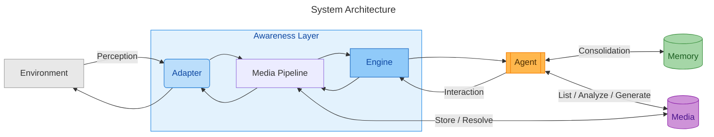

<div align="center">


<br>

# 🦄 To Be (成人)

### *To Be a Real Being*

[](https://www.npmjs.com/package/@nobeta/tobe)
[](../LICENSE)
[](https://nodejs.org/)

Model plus Harness equals Agent. Agent plus Plugins equals Being.

[**简体中文**](../README.md) · [**English**](./README_EN.md)

</div>

---

**ToBe** uses plugins to help an Agent become a person-like presence in the digital world, guided by three principles:

- **only**: Every ToBe being has a unique identity and maintains continuity as a stable instance.
- **grow**: It evolves autonomously through interaction and experience, retaining the capacity to grow over time.
- **multi**: It connects to multiple sources of perception and acts through multiple forms, continually expanding what it can perceive and how it can express itself.



| Module | Description |
| ------ | ----------- |
| [Web](../web/README.md) | Single-user console, persistent Pi Session, and configuration management |
| [Awareness](../awareness/README.md) | Environment Adapters, message prioritization, proactive delivery, and interaction routing |
| [Memory](../memory/README.md) | Persistent cognition, Dream, and evolvable Skills |
| [Media](../media/README.md) | Image/audio recognition, retrieval, generation, and Awareness integration |

## Quick Start

```bash
# Clone the repository
git clone https://github.com/Nobeta-Work/tobe.git
cd tobe

# Install dependencies and start the Web console
npm install
npm start
```

`npm start` starts ToBe Web only. It listens on `0.0.0.0:2222` by default and does not start the Agent automatically. Click **Run Agent** on the session page to start or resume the Pi Session named `tobe` inside the repository working directory.

ToBe Web explicitly loads the Pi extensions declared by the current repository; it does not rely on globally installed copies.

To bypass the Web console and start Pi directly:

```bash
npm run start:pi
```

To update ToBe:

```bash
npm run update
npm start
```

Adapter configuration, each Adapter's `data/` directory, Memory instance cognition, Dream data, and automatically generated Skills are excluded from Git tracking, so `git pull` will not overwrite them. These files still live inside the repository working directory. Back them up before deleting the repository or running `git clean -fdx`.

## Memory

Memory allows cognition and profiles to evolve, experience to consolidate, and events to leave impressions of varying depth.

> The Memory layer focuses on long-term memory and is divided into three areas: storage (the data types and storage mechanisms), consolidation (why and how memory is retained), and recall (when, why, and how memory is brought back into context).

- Session Context provides short-term memory. Long-term memory is organized as a multi-level system built on files, databases, and Skills.
- Memory types include self-cognition, episodic memory, environment memory, historical metadata, and Skills.

## Awareness

The **Awareness Layer** is how a ToBe instance perceives its environment. It receives and filters external messages through a unified pipeline that performs:

- Event metadata evaluation, authentication, and authorization
- Delayed aggregation
- Cognitive processing

The Awareness Layer may also expose interaction interfaces: interaction is an extension of perception. Each Adapter is responsible for fulfilling both its perception and interaction contracts.

| Default Adapters | Description |
| ---------------- | ----------- |
| [IIROSE](../awareness/adapters/iirose-adapter/README.md) | Group-chat scenarios with a confidence strategy designed for low-trust environments |
| [Feishu](../awareness/adapters/feishu-adapter/README.md) | Integration built on the official Feishu SDK |
| [WeChat](../awareness/adapters/wechat-adapter/README.md) | WeChat iLink sessions and Media input/output |

## Media

Media provides bidirectional media capabilities. Adapters and the Media Pipeline exchange internal `MediaMetadata`, while the Agent sees only reusable `MediaRef` values. Model APIs for image recognition, speech recognition, image generation, and speech generation can be configured independently.

Media operations fall into two categories:

- **Retrieval-based media** uses local assets under `media/lib`. It requires no just-in-time generation and is well suited to fixed responses.
- **Generative media** relies on generation APIs. Generated content carries descriptive metadata and can later be preserved as a reusable local asset.

The Agent-facing Media surface is intentionally limited to `media_list`, `media_analyze`, and `media_generate`. Adapters never call Media directly; all inbound and outbound media passes through the Awareness Media Pipeline.

## Contributing

Discussion and contributions are welcome. See the [Contributing Guide](./CONTRIBUTING_EN.md) to get started.

## License

Agent based on [Pi](https://github.com/earendil-works/pi) — *MIT*

Memory based on [TencentDB-Agent-Memory](https://github.com/TencentCloud/TencentDB-Agent-Memory) — *MIT*

MIT
